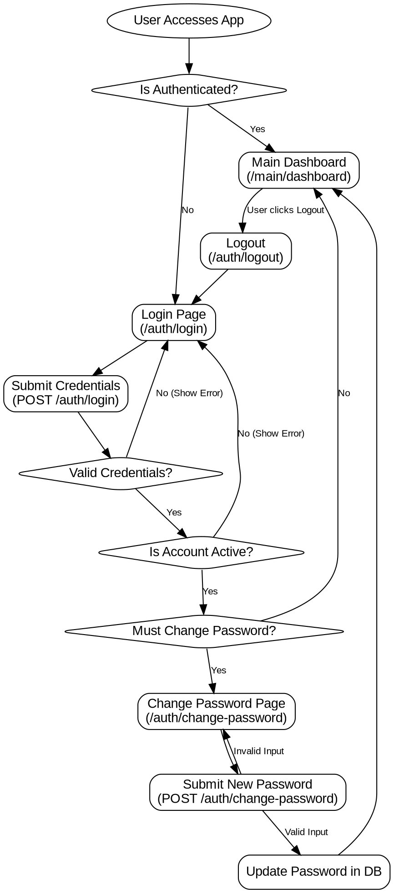
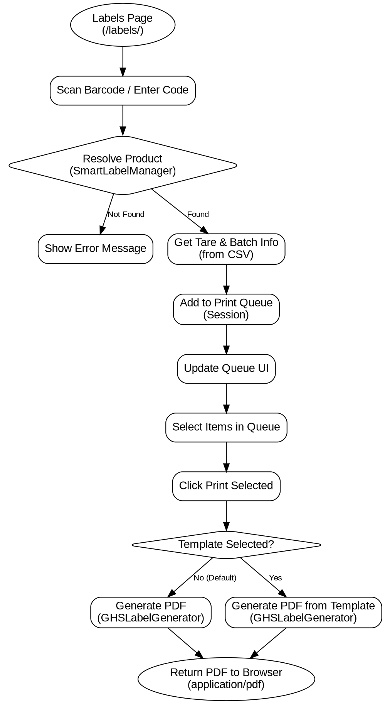
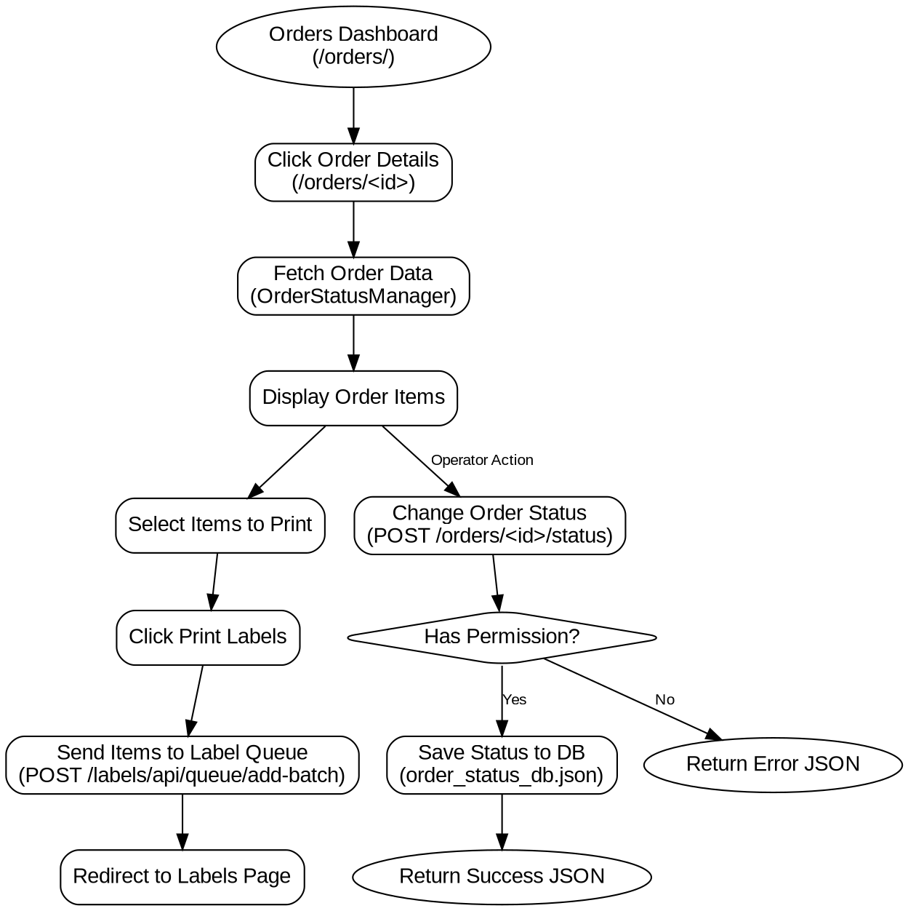
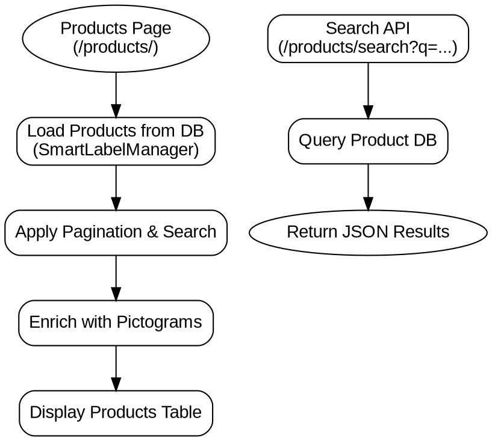
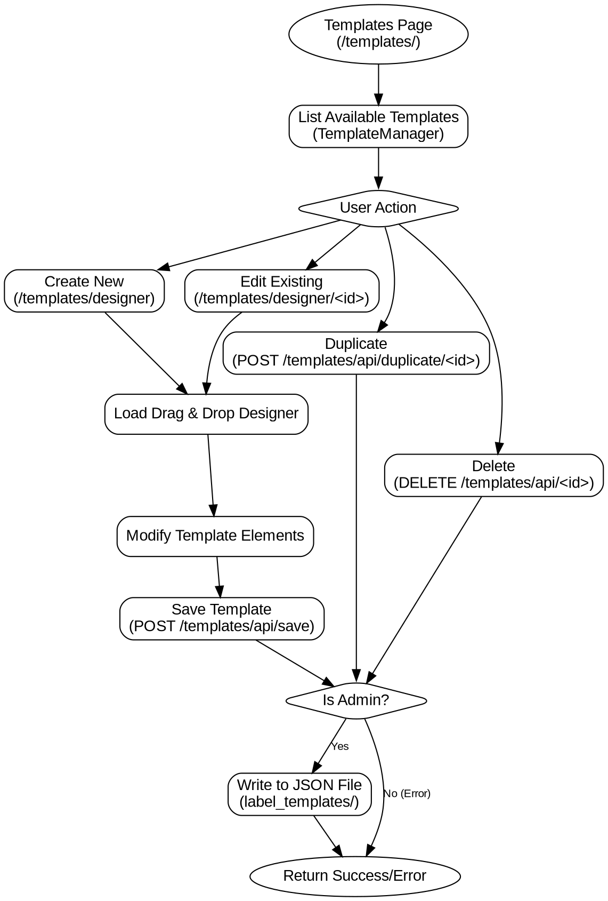

# SGA Web Application Flow Diagrams

Copy the code blocks below and paste them into [GraphvizOnline](https://dreampuf.github.io/GraphvizOnline/) to generate the flow diagrams.

## 1. Authentication Flow

## 2. Label Generation Flow

## 3. Order Processing Flow (SAP Integration)

## 4. Product Management Flow

## 5. Template Management Flow

